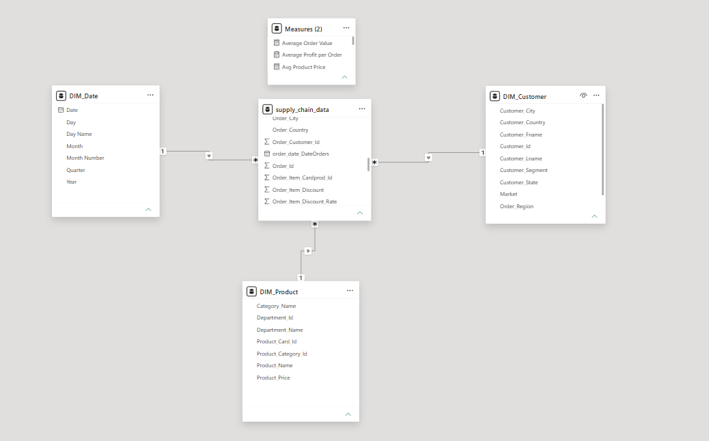

# 📦 Supply Chain Analytics Dashboard | Power BI + SQL

## 📌 Project Overview

This project presents an interactive **Supply Chain Analytics Dashboard** built using **Power BI** with data preparation and analysis performed in **SQL Server**. The dashboard helps analyze sales performance, customer behavior, product trends, and regional performance to support business decision-making.

---

## 🚀 Project Objectives

- Analyze sales and profit across different markets.
- Identify top-performing products and categories.
- Understand customer segmentation.
- Track monthly sales trends.
- Compare regional and state-wise sales performance.
- Build an interactive dashboard for business insights.

---

## 🛠️ Tools & Technologies

- Microsoft Power BI
- SQL Server
- Power Query
- DAX
- Data Modeling
- Microsoft Excel (CSV Dataset)

---

## 📂 Repository Structure

```
Supply-Chain-Analytics-Power-BI/
│
├── Dataset/
│   └── DataCoSupplyChainDataset.csv
│
├── SQL/
│   ├── Data Cleaning.sql
│   ├── Exploratory Data Analysis.sql
│   ├── Product Analysis.sql
│   ├── Customer Analysis.sql
│   ├── Sales Analysis.sql
│   ├── Advanced SQL Queries.sql
│   └── ...
│
├── Images/
│   ├── Dashboard 1.png
│   ├── Dashboard 2.png
│   ├── Dashboard 3.png
│   ├── Dashboard 4.png
│   └── Datamodel.png
│
├── Supply_Chain_Analysis.pbix
└── README.md
```

---

## 📊 Dashboard Highlights

### Dashboard 1 – Executive Overview
- Total Sales
- Total Profit
- Total Orders
- Sales Trend
- Top Products
- Sales by Category
- Sales by Market
- Customer Segment Distribution
- Top States by Sales

---

### Dashboard 2 – Customer Analytics

- Customer Distribution
- Segment Analysis
- Regional Performance
- Customer Purchasing Insights

---

### Dashboard 3 – Product Analytics

- Product Category Performance
- Top & Bottom Products
- Product Sales Analysis
- Profit Contribution

---

### Dashboard 4 – Market Analytics

- Market-wise Sales
- Country Performance
- Regional Insights
- Profit Comparison

---

## 🧹 SQL Work Performed

✔ Data Cleaning

✔ Data Transformation

✔ Data Exploration

✔ Aggregate Functions

✔ Joins

✔ Common Table Expressions (CTEs)

✔ Window Functions

✔ CASE Statements

✔ Ranking Functions

✔ Subqueries

✔ Business Insight Queries

---

## 📈 Business Insights

- Identified the highest revenue-generating markets.
- Analyzed monthly sales trends.
- Identified top-selling products.
- Compared customer segments based on sales.
- Evaluated profit contribution across categories.
- Analyzed regional sales performance.
- Built KPIs for business monitoring.

---

## 📷 Dashboard Preview

### Executive Dashboard


### Customer Dashboard


### Product Dashboard


### Market Dashboard


### Data Model



---

## ⭐ Key Skills Demonstrated

- SQL Server
- Data Cleaning
- Data Analysis
- Business Intelligence
- Power BI
- DAX
- Power Query
- Data Modeling
- Dashboard Design
- Data Visualization

---

## 👩‍💻 Author

**Rutuja Kadam**

Aspiring Data Analyst | SQL | Power BI | Python | Excel

Feel free to connect and explore my projects.
